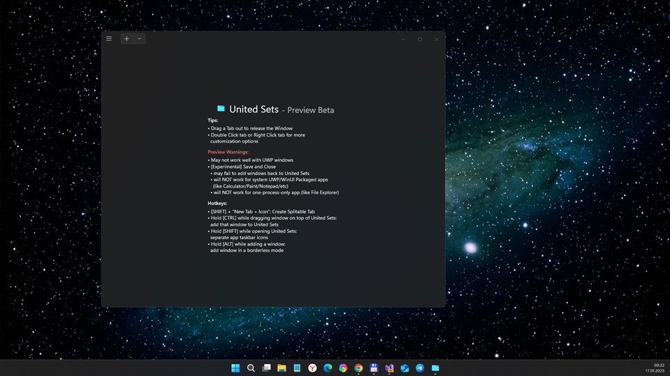

# United Sets - master branch

Micro-research of experimental UnitedSets project... maybe, for my old sweet wintablet QUMO8000w / pre-W11 x86...

## About
An open-sourced program that groups windows into tabs, inspired by the unreleased Sets feature :)

## Screenshot(s)

## Warning
The program is still in the beta state. Therefore, bugs and minor inconveniences are to be expected. 
Be cautious when using in the work environment. Save your work very often on the apps used with Untied Sets. We do not want you to lose your work!

## References
- https://github.com/Windows-Apps-Hub/UnitedSets Original UnitedSets project 
- https://www.microsoft.com/store/apps/9N7CWZ3L5RWL Microsoft Store Link
- https://www.microsoft.com/store/apps/9N9FR4ZZ6TQP Experimental Version that contains more features, but may have less stability (Warning: Installing this version will replace the regular version!)

## ..
As is. No support. RnD only. DIY.

## .
[m][e] 2025
